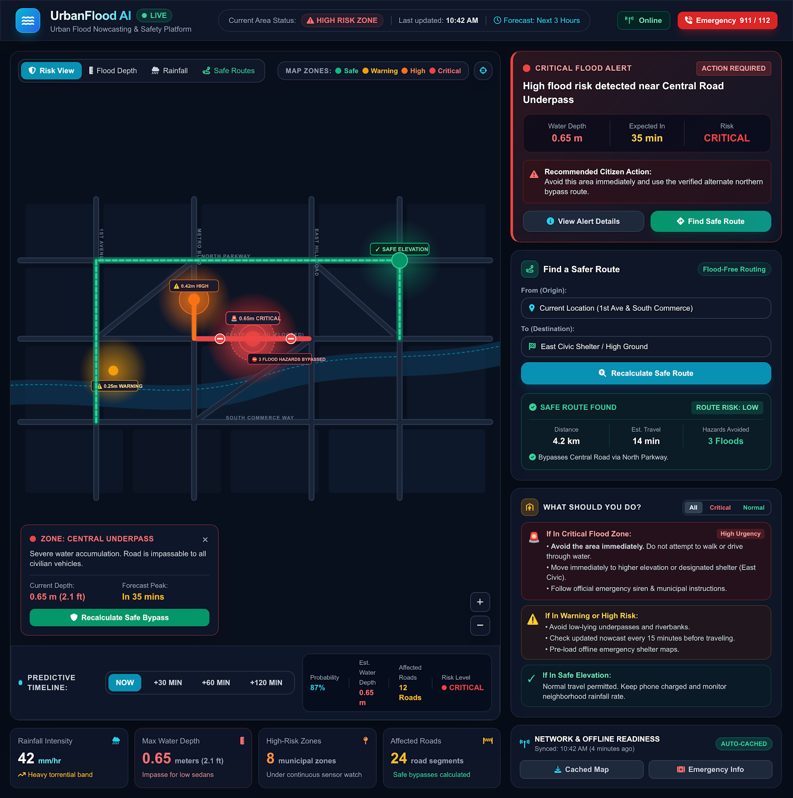
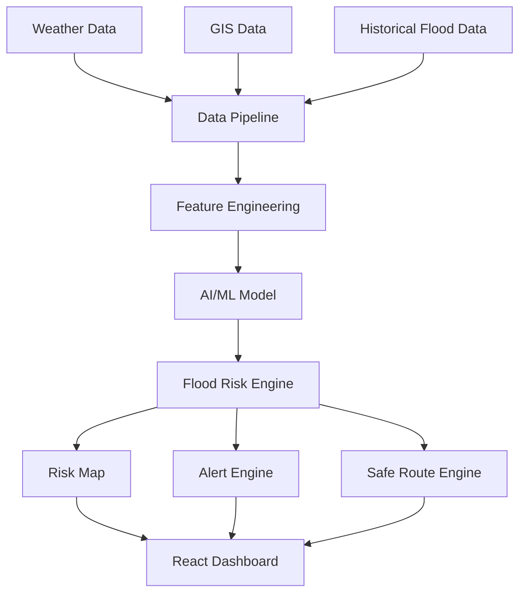
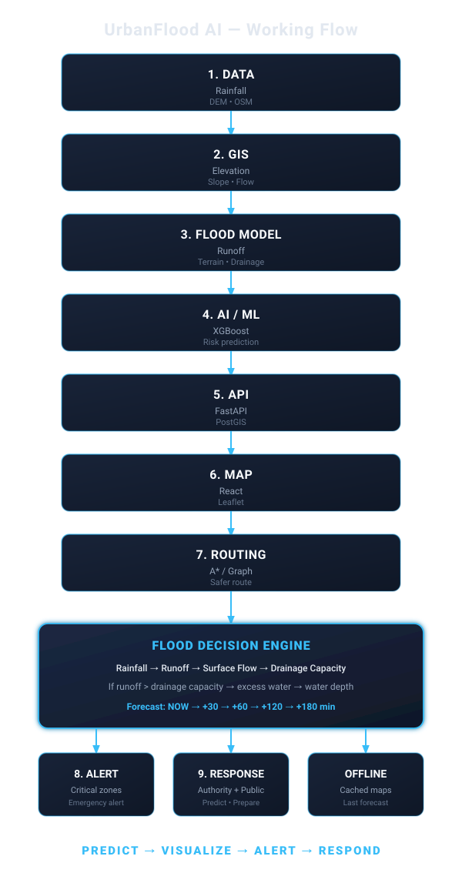
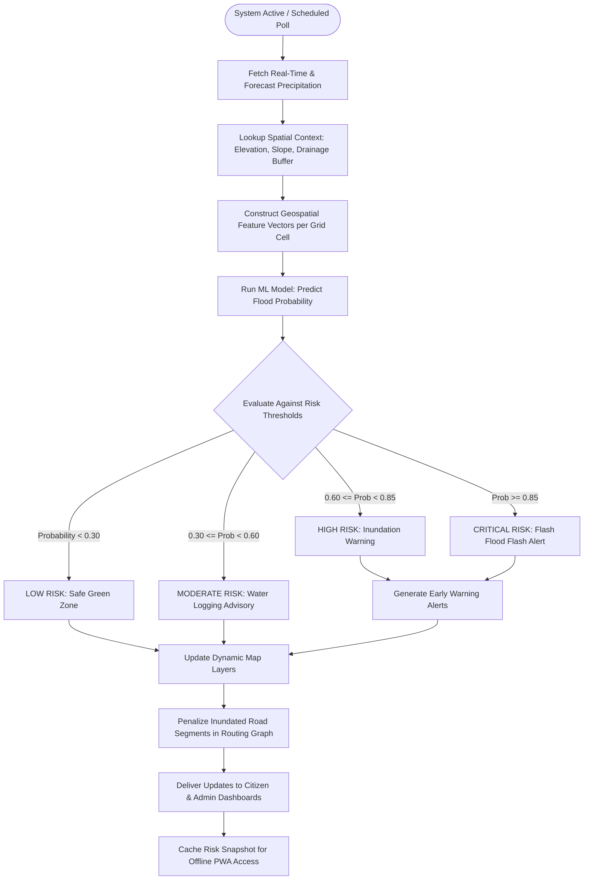
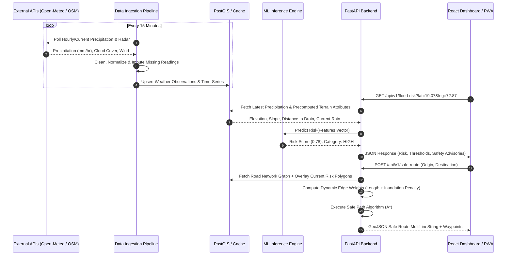

# UrbanFlood AI

An AI-powered urban flood nowcasting and early warning platform that combines weather, terrain, GIS, and machine learning data to identify flood-prone areas and help communities make safer decisions.

[](https://react.dev/)
[](https://www.python.org/)
[](https://fastapi.tiangolo.com/)
[](https://xgboost.readthedocs.io/)
[](https://postgis.net/)
[](LICENSE)
[](https://github.com/MrUtkarshsutar/UrabanFlood-AI-)

<p align="center">
  
</p>
<p align="center">
  <em>UrbanFlood AI Interactive Command &amp; Citizen Dashboard: Real-time flood risk nowcasting, underpass hazard alerts, and flood-free safe route recommendation.</em>
</p>

---

## Table of Contents

1. [Overview](#1-overview)
2. [Problem Statement](#2-problem-statement)
3. [Proposed Solution](#3-proposed-solution)
4. [Key Features](#4-key-features)
5. [System Architecture](#5-system-architecture)
6. [Working Workflow & User Journeys](#6-working-workflow--user-journeys)
7. [Data Flow & Transformation Pipeline](#7-data-flow--transformation-pipeline)
8. [AI/ML Approach](#8-aiml-approach)
9. [GIS, Cartography & Spatial Subsystems](#9-gis-cartography--spatial-subsystems)
10. [Data Sources & Feature Extraction Schema](#10-data-sources--feature-extraction-schema)
11. [Safe Routing Engine & Hazard Avoidance](#11-safe-routing-engine--hazard-avoidance)
12. [Complete Monorepo Project Structure](#12-complete-monorepo-project-structure)
13. [Technology Stack](#13-technology-stack)
14. [Installation & Rapid Setup](#14-installation--rapid-setup)
15. [Environment Variables Matrix](#15-environment-variables-matrix)
16. [Running the Project](#16-running-the-project)
17. [Exhaustive API Documentation](#17-exhaustive-api-documentation)
18. [Flood Risk Classification](#18-flood-risk-classification)
19. [Offline & Low-Connectivity Strategy](#19-offline--low-connectivity-strategy)
20. [Security & Data Protection](#20-security--data-protection)
21. [Testing Strategy](#21-testing-strategy)
22. [10-Phase Development Roadmap](#22-10-phase-development-roadmap)
23. [Recommended First Files to Create](#23-recommended-first-files-to-create)
24. [Future Scope](#24-future-scope)
25. [Team](#25-team)
26. [Contribution Guidelines](#26-contribution-guidelines)
27. [License](#27-license)
28. [Academic & Industry References](#28-academic--industry-references)

---

## 1. Overview

**UrbanFlood AI** is a modular, open-source urban flood nowcasting, risk prediction, early warning, and hazard-evading navigation system. Tailored for municipal disaster management authorities, civic emergency responders, and citizens, UrbanFlood AI synthesizes real-time meteorological forecasts with Digital Elevation Models (DEM), OpenStreetMap (OSM) topological networks, and calibrated machine learning models.

The system translates complex environmental and geospatial indicators into actionable, hyper-localized hazard indices, dynamic choropleth maps, and flood-resilient transit recommendations—even during periods of degraded cellular connectivity.

---

## 2. Problem Statement

Urban centers across the globe face an escalating frequency and severity of flash floods driven by interrelated hydrological, meteorological, and infrastructural pressures:

* **Sudden Heavy Rainfall & Convective Storms**: Short-duration, extreme precipitation events (e.g. >50mm in under 60 minutes) deliver water volumes that exceed the infiltration capacity of urban watersheds.
* **Rapid Urbanization & Soil Imperviousness**: Continuous conversion of permeable soil into concrete, asphalt, and high-density buildings reduces natural groundwater infiltration by up to 80%, multiplying peak surface runoff volume and flood wave velocities.
* **Depression Sinks & Low-Lying Pockets**: Natural low-elevation depressions, sunken vehicular underpasses, and coastal floodplains quickly turn into hazardous inundation traps within minutes of intense rain.
* **Inadequate or Obstructed Drainage**: Stormwater drainage systems engineered decades ago are chronically undersized, poorly mapped, or blocked by siltation, uncollected municipal solid waste, and tidal backflow.
* **Lack of Localized Warnings**: Traditional weather forecasts operate at macro scales (entire administrative districts or states), failing to pinpoint which specific street junctions, underpasses, or wards are experiencing dangerous inundation.
* **Difficulty Identifying Safe Routes**: Conventional commercial navigation engines steer vehicles through the shortest or fastest congested roads, regularly guiding drivers directly into submerged underpasses and lethal flash-flood zones.
* **Limited Real-Time Decision Support**: Municipal emergency response teams and disaster management agencies lack unified spatial platforms that merge incoming weather telemetry with terrain physics for preemptive evacuation planning and resource deployment.

---

## 3. Proposed Solution

UrbanFlood AI bridges this technical divide through an integrated data processing and predictive intelligence pipeline:

```
Weather Telemetry (Open-Meteo REST API)
         ↓
GIS & Terrain Models (Copernicus 30m DEM + OpenStreetMap Overpass)
         ↓
Spatial Harmonization & Automated Data Pipeline
         ↓
Hydrological Feature Engineering (Slope, Curvature, Drain Proximity, API)
         ↓
AI/ML Susceptibility Prediction (Calibrated XGBoost Classifier)
         ↓
Dynamic Flood Risk Map (Choropleth GeoJSON FeatureCollection)
         ↓
Early Warning Alert Generation (CAP-Compliant Advisory Engine)
         ↓
Safe Route Recommendation Engine (Hazard-Weighted Topological Graph)
         ↓
Citizen & Municipal Emergency Command Dashboards (React + Leaflet PWA)
```

---

## 4. Key Features

### 4.1 Citizen Dashboard
* **Current Flood Risk**: Instant localized hazard indicator based on user geolocation or address search.
* **Interactive Risk Map**: Smooth vector map depicting color-coded flood hazard zones and water logging hotspots.
* **Area Risk Level & Advisories**: Contextual safety guidelines based on calibrated severity (e.g., subway closures, low-lying caution).
* **Precipitation Monitoring**: Live hourly rainfall totals alongside short-range (1 to 6 hour) convective forecasts.
* **Push & In-App Early Warnings**: Immediate notifications when local precipitation intensity crosses safety thresholds.
* **Safe Route Navigation**: Hazard-evading route recommendations avoiding flooded streets and low-elevation sumps.
* **Emergency Shelter Locator**: Identification of nearest active municipal relief shelters, medical centers, and emergency contacts.

### 4.2 Emergency / Admin Dashboard
* **Live Incident & Risk Heatmap**: Real-time municipal overview displaying predicted inundation zones by administrative ward.
* **High-Risk Hotspot Identification**: Instant tabular ranking of zones exhibiting critical risk probabilities.
* **Rainfall & Runoff Monitoring**: Synchronized telemetry tracking station-level and gridded meteorological inputs.
* **Emergency Alert Management**: Manual and automated broadcast interface for publishing targeted civil alerts.
* **Affected Asset Monitoring**: Geospatial overlay identifying critical infrastructure (hospitals, schools, substations) within risk polygons.
* **Route & Evacuation Oversight**: Monitoring recommended arterial corridors to ensure emergency vehicles bypass flooded arteries.
* **Historical Event Analytics**: Retrospective review of past rainfall events versus model predictions for audit and validation.

### 4.3 AI Prediction Engine
* **Precipitation Dynamics**: Evaluation of 1-hour intensity, 3-hour cumulative rainfall, and forecast precipitation.
* **Topographical Modeling**: Cell-level elevation, gradient slope (degrees), and depression depth calculation.
* **Drainage Proximity Analysis**: Distance to nearest mapped stormwater conduit or open canal.
* **Historical Pattern Matching**: Integration of chronic water logging spots recorded in past monsoon seasons.
* **Calibrated Output**: Discrete flood susceptibility probabilities paired with four standard risk tiers.

### 4.4 GIS & Mapping Subsystem
* **Vector & Raster Layers**: High-performance GeoJSON visualization layered over base OpenStreetMap tiles.
* **Elevation & Slope Overlays**: Visual representation of topographic features that induce pooling.
* **Drainage & Waterways**: Layer toggle for stormwater drains, natural streams, and culverts.
* **Urban Infrastructure Overlay**: Road hierarchies, footpaths, bridges, and municipal building footprints.

---

## 5. System Architecture

UrbanFlood AI decouples data ingestion, machine learning inference, backend business logic, and client presentation into distinct, resilient layers:



### 5.1 Subsystem Decomposition
1. **Data Ingestion & Pipeline Subsystem (`data-pipeline/`)**:
   - **Meteorological Collector**: Polls Open-Meteo REST endpoints at 15-minute intervals for precipitation depth, intensity, and forecast vectors.
   - **Geospatial Extractor**: Queries OpenStreetMap via Overpass API to download highway lines and storm drainage conduits.
   - **Topographic Processor**: Clips Copernicus 30m DEM raster tiles to municipal bounds and extracts cell-level terrain features.
2. **AI/ML Modeling & Inference Engine (`ai/`)**:
   - Computes hydrological and terrain feature vectors per spatial cell.
   - Executes pre-trained, cross-validated **XGBoost** classifiers serialized with Joblib.
   - Returns calibrated flood susceptibility probabilities $P \in [0.0, 1.0]$.
3. **Core Backend Service Tier (`backend/app/`)**:
   - Built on **FastAPI** using asynchronous I/O (`async`/`await`).
   - Serves high-throughput endpoints for risk scoring, GeoJSON map layers, alerts, and routing.
   - Persists state in **PostgreSQL + PostGIS** (with SQLite fallback for local developer setups).
4. **Safe Routing Subsystem (`routing/`)**:
   - Models the road network as a directional graph using NetworkX and OSMnx.
   - Penalizes edge weights dynamically based on intersecting flood risk polygons.
5. **Presentation Tier (`frontend/`)**:
   - Single Page Application built on **React 18** and **Vite** styled with **Tailwind CSS**.
   - Renders vector layers and raster basemaps via **Leaflet** and **React-Leaflet**.
   - Includes Service Worker and IndexedDB caching for offline resilience.

---

## 6. Working Workflow & User Journeys

<p align="center">
  
</p>
<p align="center">
  <em>UrbanFlood AI End-to-End Operational Workflow: From meteorological ingestion to flood decision engine, early warning alerts, and offline access.</em>
</p>



### 6.1 Citizen Journey
1. **Access**: Citizen opens the Progressive Web App (PWA) on mobile or desktop.
2. **Geolocate**: System queries browser GNSS coordinates or accepts a manual neighborhood search.
3. **Perception**: Map immediately highlights current hazard level (e.g. 🟡 MODERATE or 🟠 HIGH) with localized advisories.
4. **Navigation**: Citizen inputs an evacuation shelter or destination; the routing engine generates a safe route avoiding all High and Critical water accumulation zones.
5. **Offline Fallback**: If cellular towers fail, cached map tiles and emergency shelter phone directories remain accessible.

### 6.2 Municipal Administrator Journey
1. **Command Center**: Real-time overview of all administrative wards with aggregate risk indicators.
2. **Infrastructure Triage**: Identifies key municipal assets (hospitals, power substations, fire stations) intersecting active flood polygons.
3. **Alert Dispatch**: Approves and broadcasts CAP-compliant emergency civil alerts to citizen mobile devices.
4. **Post-Event Audit**: Analyzes historical rainfall vs model predictions to calibrate future threshold settings.

---

## 7. Data Flow & Transformation Pipeline



### 7.1 Ingestion & Transformation Matrix

| Phase | Input Source | Primary Tools | Transformation Process | Destination |
| :--- | :--- | :--- | :--- | :--- |
| **Meteorological** | Open-Meteo REST API | `httpx`, `pandas` | Aggregate 1-hr, 3-hr, 6-hr, 24-hr antecedent precipitation totals | Memory Cache / PostgreSQL |
| **Topographical** | Copernicus 30m DEM | `rasterio`, `numpy` | Calculate Slope ($\theta$), Aspect, Curvature, and Flow Accumulation | GeoTIFF raster & pre-gridded centroid features |
| **Infrastructural** | OpenStreetMap Overpass | `osmnx`, `shapely` | Extract storm water drains, river channels, and road networks | GeoJSON layers & NetworkX graph |
| **Feature Vector** | Joined spatial attributes | `scikit-learn` | MinMax / StandardScaler normalization & categorical encoding | XGBoost DMatrix format for inference |

---

## 8. AI/ML Approach

### 8.1 Input Feature Definitions
1. **`rainfall_1h_mm`**: Observed rainfall depth over the preceding 60 minutes.
2. **`rainfall_3h_mm`**: Short-term antecedent precipitation indicating soil saturation.
3. **`forecast_rainfall_next_3h_mm`**: Forward-looking convective precipitation forecast.
4. **`elevation_m`**: Orthometric height above mean sea level extracted from the DEM.
5. **`slope_deg`**: Topographic gradient; lower slopes impede natural gravity runoff:
   $$\text{Slope} = \arctan\left(\sqrt{\left(\frac{\partial z}{\partial x}\right)^2 + \left(\frac{\partial z}{\partial y}\right)^2}\right) \times \frac{180}{\pi}$$
6. **`distance_to_drain_m`**: Euclidean distance to the nearest mapped stormwater canal or culvert.
7. **`impervious_surface_ratio`**: Fraction of ground covered by paved roads, concrete, or buildings ($0.0 \le I \le 1.0$).
8. **`historical_flood_count`**: Frequency of verified historical flooding events in the grid cell.

### 8.2 Processing Pipeline
$$\text{Raw Ingestion} \longrightarrow \text{Spatial Imputation} \longrightarrow \text{Feature Engineering} \longrightarrow \text{Standardization} \longrightarrow \text{Model Evaluation} \longrightarrow \text{Probability Calibration}$$

### 8.3 Model Architecture & Training
* **Primary Classifier**: Gradient Boosted Decision Trees (**XGBoost**) optimized with binary logistic loss.
* **Baseline Benchmark**: Scikit-learn Random Forest Classifier.
* **Handling Class Imbalance**: Rebalancing via `scale_pos_weight` to account for the rarity of extreme flooding events.
* **Calibration**: Isotonic Regression / Platt Scaling applied to map model logits into reliable empirical probabilities $P(\text{Flood} \mid X)$.
* **Serialization**: Saved via Joblib to `ai/models/saved/xgboost_flood_model_latest.joblib`.

> [!NOTE]
> **Validation Notice**: ML models in this repository provide statistical susceptibility estimates based on available open datasets. Outputs must be empirically calibrated and validated against ground-truth municipal rain gauges and historical flood water-mark records before operational life-safety deployment.

---

## 9. GIS, Cartography & Spatial Subsystems

* **Digital Elevation Models (DEM)**: Copernicus GLO-30 30-meter global raster tiles processed via `Rasterio` and `NumPy` to derive slope, aspect, and flow accumulation.
* **Road & Drainage Graph**: Extracted from OpenStreetMap (OSM) through Overpass API queries, represented as a topological network graph for routing.
* **Map Projection & CRS**: Vector geometries are standardized to **EPSG:4326** (WGS84) for web delivery and projected to local UTM zones (e.g. EPSG:32643) for metric distance and buffer calculations.
* **Vector Tiling**: Dynamic GeoJSON layers served directly to Leaflet, with client-side styling based on risk tiers.

---

## 10. Data Sources & Feature Extraction Schema

| Data Category | Source Provider | Primary Purpose | Official Source Link |
| :--- | :--- | :--- | :--- |
| **Weather & Nowcasting** | Open-Meteo API | Real-time precipitation, humidity, short-term forecast | [open-meteo.com](https://open-meteo.com/) |
| **Terrain & Elevation** | Copernicus GLO-30 DEM | 30m Digital Elevation Model, slope, depression mapping | [spacedata.copernicus.eu](https://spacedata.copernicus.eu/) |
| **Roads & Transport Network** | OpenStreetMap (OSM) | Street network graph, routing edges, surface types | [openstreetmap.org](https://www.openstreetmap.org/) |
| **Buildings & Drainage** | OpenStreetMap (OSM) | Building footprints, canals, culverts, riverbanks | [overpass-turbo.eu](https://overpass-turbo.eu/) |
| **Historical Flood Data** | Public Municipal Records / Dartmouth Flood Obs. | Ground-truth historical water logging spots for ML training | [floodobservatory.colorado.edu](https://floodobservatory.colorado.edu/) |
| **IoT Telemetry (Future)** | City IoT Sensors / Community Gateways | Ultra-localized ultrasonic water level telemetry | *Planned Future Integration* |

---

## 11. Safe Routing Engine & Hazard Avoidance

Urban road navigation during floods requires avoiding water depth rather than just traffic congestion. UrbanFlood AI models the street grid as a directed weighted graph $G = (V, E)$ where vertices $V$ represent street intersections and edges $E$ represent road segments.

### 11.1 Dynamic Cost Formulation
For each road edge $e \in E$, the traversal cost is calculated dynamically:

$$\text{Cost}(e) = \text{Length}(e) \times \left(1 + \alpha \cdot P_{\text{flood}}(e)\right) + \beta \cdot \text{Depth}_{\text{est}}(e)$$

Where:
* $\text{Length}(e)$: Geometric road segment length in meters.
* $P_{\text{flood}}(e)$: Predicted flood susceptibility probability ($0.0 \le P \le 1.0$).
* $\text{Depth}_{\text{est}}(e)$: Estimated water depth in centimeters based on depression sinks.
* $\alpha$: Risk penalty scaling factor (default: $3.0$).
* $\beta$: Depth penalty factor (default: $5.0$).

### 11.2 Critical Hazard Pruning
If an edge $e$ traverses a zone classified as **CRITICAL** ($P \ge 0.85$ or water depth $> 30\text{ cm}$), its weight is set to infinity:
$$\text{Cost}(e) = \infty$$
This mathematically guarantees that Dijkstra or A* pathfinding will never route vehicles or pedestrians through impassable underpasses or lethal flash-flood corridors.

---

## 12. Complete Monorepo Project Structure

```text
UrbanFlood-AI/
├── README.md                           # Master Project Documentation
├── LICENSE                             # MIT Open-Source License
├── .gitignore                          # Git Exclusions (Python, Node, GIS, Models)
├── .env.example                        # Template Environment Configuration
├── docker-compose.yml                  # Production Container Orchestration
├── docker-compose.dev.yml              # Local Development with Live Reload
│
├── docs/                               # Comprehensive Technical Documentation
│   ├── architecture/
│   │   ├── system-architecture.md      # Detailed Subsystem Architecture
│   │   ├── data-flow.md                # Data Ingestion & Transformation Sequence
│   │   └── working-flow.md             # Operational Workflows & User Journeys
│   ├── api/
│   │   └── api-documentation.md        # Full REST API Specification
│   ├── research/
│   │   ├── problem-statement.md        # Hydrological & Urban Flooding Analysis
│   │   ├── datasets.md                 # Dataset Dictionary & Schema
│   │   └── references.md               # Academic & Industry Citations
│   └── diagrams/                       # High-Resolution Architectural Diagrams
│
├── frontend/                           # React + Vite Web Application
│   ├── public/                         # Static Assets & Icons
│   ├── src/
│   │   ├── assets/                     # Styles, SVG Icons, Graphics
│   │   ├── components/                 # UI Component Library (Navbar, Map, Cards)
│   │   ├── pages/                      # CitizenDashboard, AdminDashboard, AlertsPage
│   │   ├── layouts/                    # Main Shell & Header/Sidebar Layouts
│   │   ├── hooks/                      # Geolocation, Weather, and Risk Custom Hooks
│   │   ├── services/                   # Axios API Clients & Offline Storage Helpers
│   │   ├── context/                    # Global Auth, Alert, and Map Contexts
│   │   ├── utils/                      # Color Formatters, GeoJSON Parsers
│   │   ├── constants/                  # Risk Levels, Map Tile URLs, Fallback Lat/Lng
│   │   ├── types/                      # TypeScript / JSDoc Interfaces
│   │   ├── App.jsx                     # Application Root & Routing Setup
│   │   └── main.jsx                    # Vite React Mount Point
│   ├── package.json                    # Node Dependencies & Build Scripts
│   ├── vite.config.js                  # Vite Bundler Configuration
│   └── tailwind.config.js              # Tailwind CSS Design System Tokens
│
├── backend/                            # FastAPI Microservices Backend
│   ├── app/
│   │   ├── main.py                     # FastAPI Application Factory & Lifespan
│   │   ├── api/
│   │   │   ├── routes/
│   │   │   │   ├── weather.py          # Weather Ingestion & Forecast Endpoints
│   │   │   │   ├── flood.py            # Flood Map & Historical Inundation
│   │   │   │   ├── risk.py             # Point & Polygon Risk Evaluation
│   │   │   │   ├── routes.py           # Flood-Aware Safe Route Engine
│   │   │   │   └── alerts.py           # Emergency Notification Broadcasting
│   │   │   └── dependencies.py         # DB Sessions & Security Context
│   │   ├── core/
│   │   │   ├── config.py               # Pydantic Settings & Environment Parsing
│   │   │   └── security.py             # JWT Creation, Password Hashing, RBAC
│   │   ├── models/                     # SQLAlchemy Database Tables
│   │   ├── schemas/                    # Pydantic Request & Response Models
│   │   ├── services/                   # Business Logic & External API Clients
│   │   ├── database/                   # Database Engine & Migration Bindings
│   │   └── utils/                      # GeoJSON Serialization & Geometry Helpers
│   ├── tests/                          # Pytest Suite for API & Logic
│   ├── requirements.txt                # Python Backend Dependencies
│   └── Dockerfile                      # Container Build Definition
│
├── ai/                                 # AI/ML Modeling & Experiments
│   ├── data/
│   │   ├── raw/                        # Unprocessed Training Datasets
│   │   ├── processed/                  # Cleaned Feature Matrices
│   │   └── external/                   # External GIS Ground-Truth Records
│   ├── notebooks/                      # Exploratory Data Analysis & Prototyping
│   ├── preprocessing/
│   │   ├── rainfall.py                 # Precipitation Aggregation Scripts
│   │   ├── elevation.py                # DEM Slope & Inundation Feature Extractor
│   │   └── feature_engineering.py      # Feature Transformation Pipeline
│   ├── models/
│   │   ├── train.py                    # XGBoost Training & K-Fold Cross Validation
│   │   ├── predict.py                  # Real-Time Predictor Interface
│   │   ├── evaluate.py                 # ROC-AUC, Precision/Recall, Brier Score
│   │   └── saved/                      # Serialized Model Weights (.joblib)
│   ├── experiments/                    # Hyperparameter Search & Benchmarks
│   ├── requirements.txt                # ML Specific Dependencies
│   └── README.md                       # ML Modeling Documentation
│
├── gis/                                # Geospatial Assets & Preprocessing
│   ├── shapefiles/                     # Municipal Wards & Catchment Polygons
│   ├── raster/                         # Copernicus DEM 30m Geotiff Rasters
│   ├── geojson/                        # Pre-Rendered Vector Boundaries
│   ├── scripts/                        # Raster Clipping & Zonal Statistics
│   ├── qgis/                           # QGIS Projects & Layer Styling Rules
│   └── README.md                       # GIS Subsystem Documentation
│
├── data-pipeline/                      # Ingestion Workers & Schedulers
│   ├── collectors/
│   │   ├── open_meteo.py               # Weather Polling Client
│   │   ├── osm.py                      # OpenStreetMap Overpass Ingestion
│   │   └── dem.py                      # DEM Tile Retriever
│   ├── processors/                     # Data Cleaning & Spatial Merging
│   ├── validators/                     # Data Hygiene & Schema Verifiers
│   ├── schedulers/                     # Periodic Background Job Definitions
│   └── README.md                       # Ingestion Pipeline Documentation
│
├── simulation/                         # Flood & Rainfall Simulation
│   ├── rainfall/                       # Synthetic Storm Hyetographs
│   ├── flood-model/                    # Simplified Overland Flow Simulator
│   ├── scenarios/                      # Stress-Test Scenarios (Monsoon Peaks)
│   └── README.md                       # Simulation Module Overview
│
├── alerts/                             # Early Warning & Civil Notification
│   ├── notification-service/           # Webhook, Push, and Mock SMS Gateways
│   ├── templates/                      # Multi-Lingual Alert Formats
│   └── README.md                       # Notification System Documentation
│
├── routing/                            # Safe Navigation Engine
│   ├── safe-route/                     # Hazard-Weighted A* & Dijkstra Routing
│   ├── graph/                          # NetworkX & OSMnx Road Graphs
│   └── README.md                       # Safe Routing Technical Notes
│
├── scripts/                            # Operational & Seeding Scripts
│   ├── setup.sh                        # Rapid Development Setup Automation
│   ├── touch_gitkeeps.ps1              # Monorepo directory verification
│   ├── seed_database.py                # Initial Database Seeding
│   └── download_datasets.py            # Open Dataset Downloader
│
└── tests/                              # Monorepo Integration & E2E Tests
    ├── frontend/                       # Vitest / Component Tests
    ├── backend/                        # Pytest API Contract Tests
    ├── ai/                             # Model Regression & Drift Tests
    └── integration/                    # End-to-End Ingestion-to-Map Tests
```

---

## 13. Technology Stack

* **Frontend**: React 18, Vite, Tailwind CSS, Leaflet, React-Leaflet, Lucide Icons, Axios
* **Backend API**: Python 3.11, FastAPI, Pydantic v2, SQLAlchemy 2.0 (Async), Uvicorn
* **AI / Machine Learning**: Scikit-learn, XGBoost, Pandas, NumPy, SciPy, Joblib
* **GIS & Geospatial**: GeoPandas, Shapely, Rasterio, NetworkX, OSMnx
* **Database & Persistence**: PostgreSQL with PostGIS extension (SQLite fallback for local development)
* **DevOps & Infrastructure**: Docker, Docker Compose, GitHub Actions, Vercel (Frontend), Render / Railway (Backend)

---

## 14. Installation & Rapid Setup

### 14.1 Prerequisites
* **Git** installed
* **Node.js** (v18.x or higher) and **npm**
* **Python** (v3.10 or v3.11 recommended)
* **GDAL & GEOS** libraries (for geospatial Python packages like GeoPandas)
* *Optional*: Docker & Docker Compose for containerized execution

### 14.2 Step-by-Step Setup

```bash
# 1. Clone the repository
git clone https://github.com/MrUtkarshsutar/UrabanFlood-AI-.git
cd UrabanFlood-AI-

# 2. Configure Environment Variables
cp .env.example .env

# 3. Create and activate a Python Virtual Environment
python -m venv .venv

# On Linux/macOS:
source .venv/bin/activate

# On Windows (PowerShell):
.\.venv\Scripts\Activate.ps1

# 4. Install Backend Dependencies
pip install --upgrade pip
pip install -r backend/requirements.txt

# 5. Install AI / ML Dependencies
pip install -r ai/requirements.txt

# 6. Install Frontend Dependencies
cd frontend
npm install
cd ..
```

### 14.3 Automated Setup Script
On Linux, macOS, or Windows WSL, you can initialize the entire environment in a single command:
```bash
chmod +x scripts/setup.sh
./scripts/setup.sh
```

---

## 15. Environment Variables Matrix

A ready-to-use template is maintained in [`.env.example`](.env.example):

| Variable Name | Required | Default Value | Description |
| :--- | :---: | :--- | :--- |
| `ENVIRONMENT` | Yes | `development` | Operational mode (`development`, `staging`, `production`) |
| `DEBUG` | No | `true` | Enables verbose FastAPI logging and reload features |
| `SECRET_KEY` | Yes | *Auto-generated* | Cryptographic secret for signing JWT admin tokens |
| `DATABASE_URL` | Yes | `postgresql+asyncpg://...` | Asynchronous connection string for PostgreSQL/PostGIS |
| `POSTGIS_ENABLED` | No | `false` | Enables spatial PostGIS extension queries |
| `OPEN_METEO_BASE_URL` | Yes | `https://api.open-meteo.com/v1/forecast` | Meteorological nowcasting REST endpoint |
| `OSM_OVERPASS_URL` | Yes | `https://overpass-api.de/api/interpreter` | OpenStreetMap Overpass query endpoint |
| `MODEL_PATH` | Yes | `ai/models/saved/xgboost_flood_model_latest.joblib` | Filepath to serialized XGBoost model |
| `RISK_THRESHOLD_MODERATE` | No | `0.30` | Minimum probability cutoff for Moderate risk |
| `RISK_THRESHOLD_HIGH` | No | `0.60` | Minimum probability cutoff for High risk |
| `RISK_THRESHOLD_CRITICAL` | No | `0.85` | Minimum probability cutoff for Critical risk |
| `VITE_API_BASE_URL` | Yes | `http://localhost:8000/api/v1` | Backend URL consumed by the React application |

---

## 16. Running the Project

### Option A: Local Development (Native)

1. **Start the FastAPI Backend Service**:
   ```bash
   uvicorn backend.app.main:app --host 127.0.0.1 --port 8000 --reload
   ```
   * Swagger Documentation: `http://localhost:8000/docs`
   * Redoc Documentation: `http://localhost:8000/redoc`

2. **Start the React Frontend Application**:
   ```bash
   cd frontend
   npm run dev
   ```
   * Frontend Application: `http://localhost:5173`

### Option B: Containerized Execution (Docker Compose)

```bash
# Launch entire stack (PostGIS, FastAPI, React) via Docker Compose:
docker-compose -f docker-compose.dev.yml up --build
```

---

## 17. Exhaustive API Documentation

All REST routes are served under the versioned prefix `/api/v1`.

### 1. System Health Check
* **Endpoint**: `GET /health`
* **Status**: **Implemented**
* **Purpose**: Verifies backend service status, database connectivity, and ML model availability.
* **Authentication**: None
* **Example Request**: `GET /api/v1/health`
* **Example Response (200 OK)**:
  ```json
  {
    "status": "healthy",
    "timestamp": "2026-09-19T12:00:00Z",
    "version": "1.0.0",
    "services": {
      "database": "connected",
      "ml_inference": "loaded",
      "weather_pipeline": "active"
    }
  }
  ```

---

### 2. Meteorological Nowcasting
* **Endpoint**: `GET /weather`
* **Status**: **Implemented**
* **Purpose**: Fetches real-time precipitation, intensity, and next-6h forecast for a latitude/longitude coordinate pair.
* **Query Parameters**:
  - `lat` (float, required): Latitude in decimal degrees (e.g. `19.0760`)
  - `lng` (float, required): Longitude in decimal degrees (e.g. `72.8777`)
* **Example Request**: `GET /api/v1/weather?lat=19.0760&lng=72.8777`
* **Example Response (200 OK)**:
  ```json
  {
    "latitude": 19.0760,
    "longitude": 72.8777,
    "current": {
      "precipitation_mm": 38.5,
      "precipitation_intensity_mm_per_hr": 24.2,
      "temperature_celsius": 28.4,
      "humidity_percent": 94,
      "condition": "Heavy Rain"
    },
    "forecast_next_6h": [
      {"hour": 1, "predicted_rainfall_mm": 22.0},
      {"hour": 2, "predicted_rainfall_mm": 18.5},
      {"hour": 3, "predicted_rainfall_mm": 9.0},
      {"hour": 4, "predicted_rainfall_mm": 4.2},
      {"hour": 5, "predicted_rainfall_mm": 2.0},
      {"hour": 6, "predicted_rainfall_mm": 1.0}
    ]
  }
  ```

---

### 3. Localized Flood Risk Assessment
* **Endpoint**: `GET /flood-risk`
* **Status**: **Implemented**
* **Purpose**: Evaluates point flood susceptibility probability, hazard level, and contributing topographical factors.
* **Query Parameters**:
  - `lat` (float, required): Latitude
  - `lng` (float, required): Longitude
* **Example Request**: `GET /api/v1/flood-risk?lat=19.0760&lng=72.8777`
* **Example Response (200 OK)**:
  ```json
  {
    "coordinates": {"lat": 19.0760, "lng": 72.8777},
    "risk_score": 0.76,
    "risk_level": "HIGH",
    "risk_color": "#ea580c",
    "factors": {
      "rainfall_intensity_score": 0.85,
      "elevation_meters": 8.2,
      "slope_degrees": 1.1,
      "distance_to_drain_meters": 320.0,
      "drainage_congestion_index": 0.72
    },
    "advisory": "Hazardous road inundation likely. Pedestrian and low-vehicle movement discouraged."
  }
  ```

---

### 4. Dynamic Flood Risk Map
* **Endpoint**: `GET /flood-map`
* **Status**: **Implemented**
* **Purpose**: Streams active flood risk zones formatted as a standard GeoJSON FeatureCollection for Leaflet rendering.
* **Query Parameters**:
  - `bbox` (string, optional): Bounding box filter `min_lng,min_lat,max_lng,max_lat`
  - `min_risk` (string, optional): Filter by minimum risk (`LOW`, `MODERATE`, `HIGH`, `CRITICAL`)
* **Example Request**: `GET /api/v1/flood-map?bbox=72.82,18.98,72.95,19.15&min_risk=MODERATE`
* **Example Response (200 OK)**:
  ```json
  {
    "type": "FeatureCollection",
    "features": [
      {
        "type": "Feature",
        "geometry": {
          "type": "Polygon",
          "coordinates": [[[72.85, 19.05], [72.86, 19.05], [72.86, 19.06], [72.85, 19.06], [72.85, 19.05]]]
        },
        "properties": {
          "zone_id": "ZN-401",
          "ward": "F-North",
          "risk_level": "CRITICAL",
          "risk_score": 0.89,
          "water_depth_cm_est": 45.0,
          "updated_at": "2026-09-19T12:15:00Z"
        }
      }
    ]
  }
  ```

---

### 5. Hazard-Evading Safe Route
* **Endpoint**: `POST /safe-route`
* **Status**: **Implemented**
* **Purpose**: Computes safe navigation paths circumventing active flood zones and low-elevation underpasses.
* **Request Body**:
  ```json
  {
    "origin": {"lat": 19.0700, "lng": 72.8700},
    "destination": {"lat": 19.1100, "lng": 72.8900},
    "mode": "driving",
    "avoid_risk_levels": ["HIGH", "CRITICAL"]
  }
  ```
* **Example Response (200 OK)**:
  ```json
  {
    "status": "success",
    "route": {
      "distance_meters": 5840,
      "duration_seconds": 960,
      "max_encountered_risk": "MODERATE",
      "geometry": {
        "type": "LineString",
        "coordinates": [
          [72.8700, 19.0700],
          [72.8735, 19.0780],
          [72.8820, 19.0950],
          [72.8900, 19.1100]
        ]
      },
      "segments": [
        {"instruction": "Head north on Elevated Expressway", "risk": "LOW", "distance_m": 2300},
        {"instruction": "Turn right onto Ridge Road", "risk": "MODERATE", "distance_m": 3540}
      ]
    },
    "rerouted_due_to_hazard": true
  }
  ```

---

### 6. Early Warning Civil Alerts
* **Endpoint**: `GET /alerts`
* **Status**: **Implemented**
* **Purpose**: Retrieves active civil flood warnings, advisories, and nearby relief shelter points.
* **Query Parameters**:
  - `lat` (float, optional): Latitude to filter proximal alerts
  - `lng` (float, optional): Longitude to filter proximal alerts
  - `status` (string, optional): `active` or `resolved` (default: `active`)
* **Example Request**: `GET /api/v1/alerts?lat=19.0760&lng=72.8777`
* **Example Response (200 OK)**:
  ```json
  {
    "count": 1,
    "alerts": [
      {
        "id": "ALT-20260919-002",
        "severity": "CRITICAL",
        "headline": "Severe Inundation Alert: Hindmata & Gandhi Market Junctions",
        "message": "Water accumulation exceeding 40cm. Subway closed. Avoid all non-essential travel.",
        "issued_at": "2026-09-19T11:45:00Z",
        "expires_at": "2026-09-19T15:00:00Z",
        "affected_zones": ["ZN-401", "ZN-405"],
        "emergency_shelter": {
          "name": "Community Civic Center Ward F",
          "distance_km": 1.2,
          "contact": "+91-22-2410-0000"
        }
      }
    ]
  }
  ```

---

### 7. Direct Machine Learning Inference
* **Endpoint**: `POST /prediction`
* **Status**: **Planned / In-Progress**
* **Purpose**: Batch evaluation and automated testing of arbitrary raw feature vectors.
* **Request Body**:
  ```json
  {
    "rainfall_1h_mm": 42.0,
    "rainfall_3h_mm": 78.5,
    "rainfall_24h_mm": 130.0,
    "elevation_m": 6.5,
    "slope_deg": 0.8,
    "distance_to_drain_m": 450.0,
    "impervious_surface_ratio": 0.88,
    "historical_flood_count": 5
  }
  ```
* **Example Response (200 OK)**:
  ```json
  {
    "flood_probability": 0.824,
    "risk_category": "HIGH",
    "feature_importances": {
      "rainfall_1h_mm": 0.41,
      "elevation_m": 0.28,
      "distance_to_drain_m": 0.18,
      "impervious_surface_ratio": 0.13
    },
    "model_version": "1.0.0"
  }
  ```

---

## 18. Flood Risk Classification

| Tier | Category | Risk Score ($P$) | Impact & Physical Manifestation | Recommended Operational Action |
| :---: | :--- | :---: | :--- | :--- |
| 🟢 | **LOW** | $0.00 \le P < 0.30$ | Safe conditions; normal road transit; stormwater drains functioning below capacity. | Normal transit; monitor standard weather advisories. |
| 🟡 | **MODERATE** | $0.30 \le P < 0.60$ | Minor localized pooling in road gutters; slow traffic flow; pedestrian walkways wet. | Exercise caution in depressed underpasses; drive at reduced speeds. |
| 🟠 | **HIGH** | $0.60 \le P < 0.85$ | Substantial water logging (15–30 cm); low-clearance vehicles stalled; basements vulnerable. | Avoid non-essential vehicular movement; activate safe-route bypass. |
| 🔴 | **CRITICAL** | $0.85 \le P \le 1.00$ | Flash flooding (>30 cm); swift overland current; underpasses submerged; electrical hazard. | Immediate evacuation from low-lying areas; seek civic relief shelters. |

> [!IMPORTANT]
> The numerical probability cutoffs above are configurable within model settings and should be calibrated using historical empirical rainfall-inundation curves specific to each municipal watershed.

---

## 19. Offline & Low-Connectivity Strategy

During severe weather events, cellular base stations and electrical grids frequently suffer brownouts and physical failures. UrbanFlood AI implements a graceful degradation architecture:

```
Cloud / Server Cluster
         ↓ (When connectivity is active)
Periodic Background Data Synchronization
         ↓
Local Device Storage (Service Worker Cache & IndexedDB)
         ↓
Offline Progressive Web App (PWA) Execution
         ├── Cached Vector Risk Basemaps
         ├── Cached Emergency Phone Numbers & Civic Shelters
         └── Local Geolocation Hazard Lookups
```

### 19.1 Client-Side Offline Resilience
* **Service Worker Caching**: All frontend JavaScript, CSS bundles, and base Leaflet map tiles for the selected city are cached locally.
* **IndexedDB Snapshotting**: The most recent valid `/flood-map` GeoJSON payload and active `/alerts` are preserved locally on the client device.
* **Device GPS Independence**: HTML5 Geolocation operates through satellite GNSS signals, enabling users to view their position relative to the cached flood polygon map even when 4G/5G internet is intermittent.

### 19.2 Future Integration Possibilities (Planned)
* **SMS & Cell Broadcast**: Integration with government emergency broadcasting for zero-data push delivery.
* **LoRaWAN Meshes**: Hyper-localized solar-powered community gateways relaying water-level telemetry to edge display boards.
* **Community Offline Kiosks**: Raspberry Pi-based local Wi-Fi captive portals installed at designated disaster relief shelters.

---

## 20. Security & Data Protection

UrbanFlood AI adheres to modern web and spatial security standards:

* **Environment Variable Isolation**: Zero secrets, database passwords, or private tokens committed to version control; strict enforcement of `.gitignore` and `.env.example`.
* **Robust Input Validation**: Strict validation on all incoming query and body parameters via Pydantic schemas, mitigating injection vectors.
* **API Rate Limiting**: Middleware-level throttling to prevent Denial-of-Service (DoS) abuse on public weather and routing endpoints.
* **CORS Whitelisting**: Granular Cross-Origin Resource Sharing restricting production API access strictly to designated frontend domains.
* **Administrative Role-Based Access Control (RBAC)**: JSON Web Token (JWT) Bearer authentication safeguarding alert broadcasting, manual model triggers, and data ingestion endpoints.
* **Zero PII Storage**: Citizen location queries are processed in-memory for immediate routing/risk calculations and are not persisted to database logs.

---

## 21. Testing Strategy

* **Frontend Unit & Component Testing**: Vitest and React Testing Library verifying UI state updates, map layer mounting, and offline fallback rendering:
  ```bash
  cd frontend && npm run test
  ```
* **Backend API Integration Testing**: Pytest testing REST endpoints, schema validation, and database queries:
  ```bash
  pytest backend/tests/
  ```
* **AI/ML Model Validation**: Regression tests verifying deterministic output ranges ($0.0 \le P \le 1.0$) and preventing feature drift:
  ```bash
  python ai/models/evaluate.py --data ai/data/processed/test_features.csv
  ```
* **GIS Layer Sanitization**: Automated validation confirming all published GeoJSON polygons adhere to valid WGS84 coordinates without topology self-intersections.

---

## 22. 10-Phase Development Roadmap

| Phase | Title | Classification | Key Deliverables & Milestones |
| :---: | :--- | :---: | :--- |
| **Phase 1** | **Project Setup & Base UI** | **MVP** | Monorepo structure, Docker configuration, Vite + React layout, Leaflet base layer, Tailwind dark mode. |
| **Phase 2** | **Weather API Ingestion** | **MVP** | Open-Meteo polling client, 15-minute scheduled cache, precipitation normalization, `/api/v1/weather`. |
| **Phase 3** | **GIS & Elevation Processing** | **MVP** | Copernicus 30m DEM clipping, slope calculation, OSM road/drain extraction, GeoJSON boundary generation. |
| **Phase 4** | **Data Pipeline & Feature Store** | **MVP** | Spatial join of weather to DEM cells, feature normalization pipeline, data hygiene sanity checks. |
| **Phase 5** | **Machine Learning Model** | **MVP** | Baseline XGBoost flood risk classifier, cross-validation on historical data, Joblib serialization, `/api/v1/prediction`. |
| **Phase 6** | **Interactive Flood Risk Map** | **MVP** | GeoJSON vector streaming `/api/v1/flood-map`, dynamic Leaflet choropleth coloring, popup hazard factors. |
| **Phase 7** | **Safe Routing Engine** | **Production** | Topological OSM road graph parsing, flood risk penalty cost function, A* safe-route solver, `/api/v1/safe-route`. |
| **Phase 8** | **Early Warning Alert System** | **Production** | Municipal threshold evaluation engine, automated civil alert generation, CAP-compliant notifications, `/api/v1/alerts`. |
| **Phase 9** | **Offline & Low-Connectivity** | **Production** | Service Worker caching, IndexedDB map layer snapshots, GNSS navigation during outages, PWA installation. |
| **Phase 10** | **Testing & Cloud Deployment** | **Production** | Vitest UI suite, Pytest API integration tests, Vercel frontend CI/CD, Render backend deployment, GitHub Actions. |

---

## 23. Recommended First Files to Create

To implement the functional MVP smoothly, create the following core files in order:

### Priority 1: Core Backend Configuration & Weather Service
1. `backend/app/core/config.py`: Pydantic Settings class parsing `.env` parameters (Open-Meteo URL, database connection, secret keys).
2. `backend/app/services/weather_service.py`: Async HTTP service querying Open-Meteo with in-memory TTL caching to prevent rate-limit throttling.
3. `backend/app/api/routes/weather.py`: REST route exposing `GET /api/v1/weather?lat=...&lng=...`.

### Priority 2: AI Feature Processing & Mock/Baseline Predictor
4. `ai/preprocessing/rainfall.py`: Derives 1-hour, 3-hour, and 24-hour antecedent rainfall features from raw weather time-series.
5. `ai/models/predict.py`: Inference wrapper class that loads the serialized model and outputs calibrated risk probabilities and hazard labels.
6. `backend/app/api/routes/risk.py`: Route connecting the weather service and model predictor to serve `GET /api/v1/flood-risk`.

### Priority 3: Interactive Frontend Map & Dashboard Shell
7. `frontend/src/services/api.js`: Axios instance pre-configured with base URL and error handlers.
8. `frontend/src/components/Map/FloodMap.jsx`: Leaflet map component rendering OpenStreetMap tiles, user location marker, and GeoJSON hazard overlay.
9. `frontend/src/pages/CitizenDashboard.jsx`: Primary citizen view showing current geolocation flood risk badge, weather metrics, emergency shelter shortcuts, and the interactive map.

---

## 24. Future Scope

The UrbanFlood AI roadmap envisions several modular expansions:

* **IoT Water-Level Sensor Networks**: Real-time ultrasonic and pressure-transducer telemetry deployed in chronic stormwater drains to provide continuous ground-truth calibration.
* **Edge AI Deployments**: Lightweight ONNX runtime execution on Raspberry Pi edge nodes installed at critical city underpasses.
* **SMS & National Cell Broadcast Integration**: Direct gateway linkage with national disaster management authorities for localized alert broadcasting.
* **LoRaWAN Community Sensing**: Resilient, long-range, low-power telemetry transmission bypassing commercial cellular networks during disasters.
* **Satellite Synthetic Aperture Radar (SAR)**: Automated ingestion of Sentinel-1 radar imagery for post-storm flood inundation footprint verification.
* **Physics-Informed Neural Networks (PINNs)**: Combining Saint-Venant hydraulic shallow-water equations with deep learning for ultra-fast, hydrodynamically consistent inundation mapping.
* **Multi-City Federation**: Generalizing the spatial data ingestion pipeline to seamlessly ingest arbitrary municipal boundaries across global regions.

---

## 25. Team

| Team Member | Functional Domain & Role |
| :--- | :--- |
| **Member 1** | AI / Machine Learning Lead |
| **Member 2** | Backend Services & API Engineer |
| **Member 3** | Frontend Web & Mobile Lead |
| **Member 4** | GIS & Geospatial Analyst |
| **Member 5** | Data Pipeline & Ingestion Engineer |
| **Member 6** | DevOps & Cloud Infrastructure |
| **Member 7** | UI/UX & Accessible Design Specialist |
| **Member 8** | Hydrology & Urban Research Lead |
| **Member 9** | System Integration & QA Engineer |

---

## 26. Contribution Guidelines

Contributions from the urban planning, open-source geospatial, and software engineering communities are warmly welcomed.

1. **Fork** the repository on GitHub.
2. **Create a Feature Branch**: `git checkout -b feature/dynamic-route-penalty`
3. **Commit Your Changes**: `git commit -m "feat(routing): incorporate elevation slope penalty into A* cost"`
4. **Push to Your Branch**: `git push origin feature/dynamic-route-penalty`
5. **Open a Pull Request** detailing your changes, context, and test verification results.

---

## 27. License

This project is licensed under the terms of the **MIT License**. See the [LICENSE](LICENSE) file for complete details.

---

## 28. Academic & Industry References

1. **Beven, K. J., & Kirkby, M. J. (1979).** *A physically based, variable contributing area model of basin hydrology.* Hydrological Sciences Bulletin, 24(1), 43-69.
2. **Chen, T., & Guestrin, C. (2016).** *XGBoost: A Scalable Tree Boosting System.* In Proceedings of the 22nd ACM SIGKDD International Conference on Knowledge Discovery and Data Mining (pp. 785-794).
3. **Boeing, G. (2017).** *OSMnx: New methods for acquiring, constructing, analyzing, and visualizing complex street networks.* Computers, Environment and Urban Systems, 65, 126-139.
4. **European Space Agency (ESA).** *Copernicus Global Digital Elevation Model (GLO-30).* [https://spacedata.copernicus.eu/](https://spacedata.copernicus.eu/)
5. **Open-Meteo Documentation.** *Free Weather API for Non-Commercial & Open Source Projects.* [https://open-meteo.com/](https://open-meteo.com/)
6. **World Meteorological Organization (WMO).** *Guidelines on Nowcasting Techniques for Extreme Weather Events.* WMO-No. 1198.