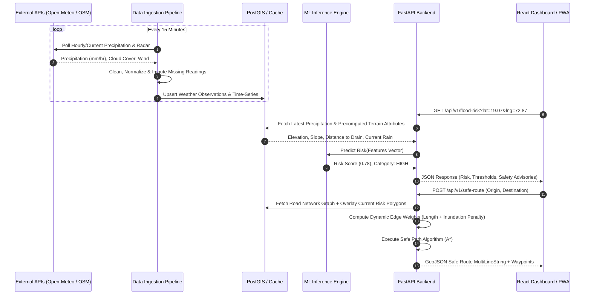

# Data Flow Architecture - UrbanFlood AI

## 1. End-to-End Data Pipeline

The data flow in UrbanFlood AI operates in two synchronized cadences:
1. **Periodic Batch Ingestion & Aggregation** (15 to 30-minute intervals) for weather updates and watershed feature computation.
2. **On-Demand Real-Time Request-Response** for user geolocation queries, custom area risk evaluation, and dynamic safe route pathfinding.

---

## 2. Ingestion & Transformation Matrix

| Phase | Input Source | Primary Tools | Transformation | Output Destination |
| :--- | :--- | :--- | :--- | :--- |
| **Meteorological** | Open-Meteo API | `requests`, `pandas` | Aggregate 1-hr, 3-hr, 6-hr, 24-hr antecedent rainfall totals | In-memory cache & Timescale/PostgreSQL table |
| **Topographical** | Copernicus 30m DEM | `rasterio`, `numpy` | Calculate Slope (degrees), Aspect, Curvature, and Flow Direction | GeoTIFF raster & pre-gridded centroid features |
| **Infrastructural** | OpenStreetMap Overpass | `osmnx`, `shapely` | Extract storm water drains, river channels, and road networks | GeoJSON layers & NetworkX graph |
| **Feature Vector** | Joined attributes | `scikit-learn` | MinMax / StandardScaler normalization & categorical encoding | XGBoost DMatrix format for inference |
