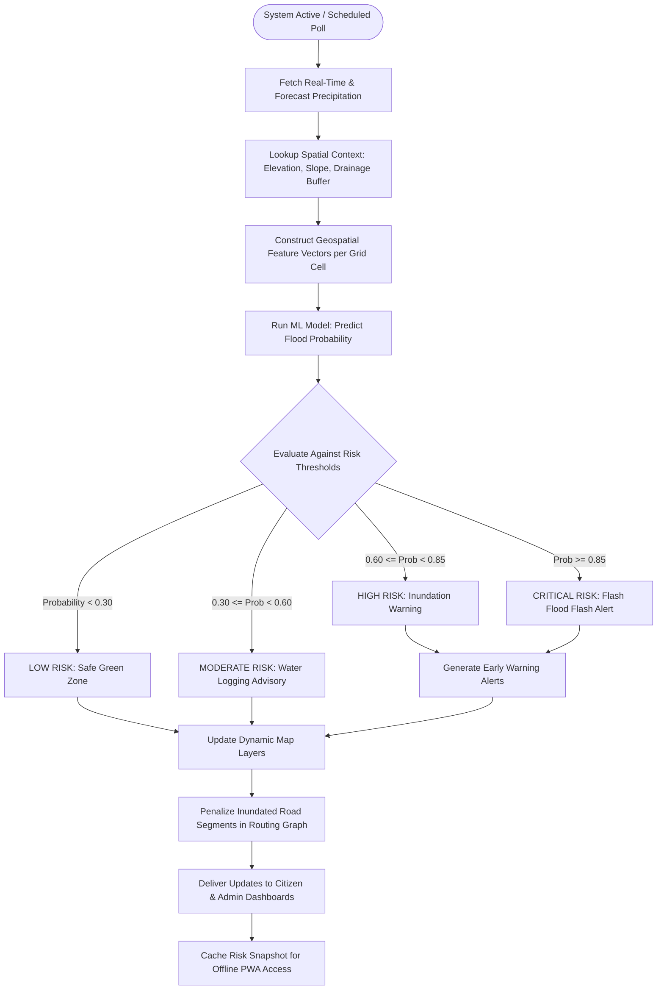

# Working Workflow - UrbanFlood AI

## 1. System Operational Workflow

UrbanFlood AI functions as an event-driven and schedule-driven system designed to automate the early-warning and evacuation lifecycle.

---

## 2. User Journey Scenarios

### 2.1 Citizen User
1. **Access**: Citizen opens web application on mobile or desktop (PWA).
2. **Geolocate**: System detects current location or accepts manual search.
3. **Hazard Perception**: Map displays color-coded hazard zones with clear rainfall and water-logging indicators.
4. **Evacuation & Navigation**: Citizen enters destination (e.g., home or emergency shelter). The routing engine calculates the path that completely circumvents High and Critical zones, preferring high-elevation roads.
5. **Offline Mode**: If network connectivity drops, the application displays the latest cached risk map, emergency telephone hotlines, and offline guidance.

### 2.2 Municipal / Disaster Management Admin
1. **Command View**: Real-time multi-ward overview with aggregate high-risk metrics.
2. **Alert Management**: Ability to draft, review, and broadcast localized push notifications and alerts.
3. **Infrastructure Monitoring**: Tracking critical infrastructure (hospitals, power substations, fire stations) intersecting predicted flood polygons.
